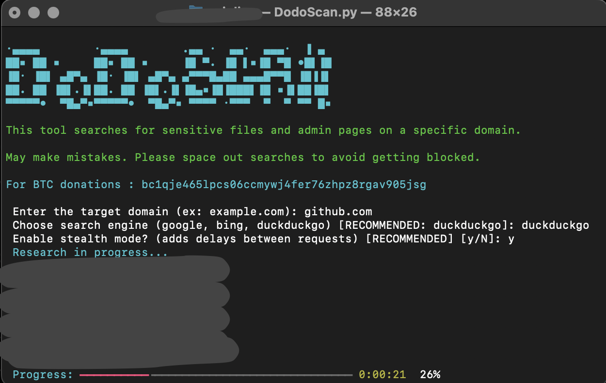

# DodoScan - Advanced Dorking Tool

## Description

DodoScan is an advanced dorking tool designed to help security professionals and researchers identify sensitive files and exposed admin pages on a target domain. It utilizes Google, Bing, and DuckDuckGo search engines to gather potentially vulnerable or publicly accessible resources.

This tool is intended for ethical hacking and security auditing. Unauthorized use against external systems is strictly prohibited.

## Bitcoin Donations

If you find DodoScan useful and would like to support its development, you can donate via Bitcoin:

**BTC Address**: `bc1qje465lpcs06ccmywj4fer76zhpz8rgav905jsg`

Your support is appreciated.

----

## Features

- **Sensitive File and Admin Page Discovery**: Automatically finds exposed backups, database dumps, configuration files, and admin login pages.
- **Stealth Mode**: Adds randomized delays between requests to reduce the risk of detection.
- **Custom Search Engine Selection**: Supports Google, Bing, and DuckDuckGo (recommended for privacy).
- **Real-time Progress Display**: Tracks scanning progress interactively.
- **No License**: The tool is free to use, modify, and distribute without restrictions.

## Installation

### Requirements

- Python 3.8+
- Required dependencies:
  ```bash
  pip install typer rich requests beautifulsoup4 httpx
  ```

### Setup

1. **Clone the repository**:
   ```bash
   git clone https://github.com/SiIv3r/DodoScan.git
   cd dodoscan
   ```

2. **Create and activate a virtual environment**:
   ```bash
   python3 -m venv env
   source env/bin/activate  # Windows: env\Scripts\activate
   ```

3. **Install dependencies**:
   ```bash
   pip install -r requirements.txt
   ```

## Usage

1. **Run the tool**:
   ```bash
   python dodoscan.py
   ```

2. **Enter the required information**:
   - Target domain (e.g., `example.com`)
   - Search engine (`google`, `bing`, or `duckduckgo`)
   - Enable or disable stealth mode

3. **Review the results**:
   - The tool will list discovered sensitive files, admin panels, and other exposed resources.
   - A final summary will display the number of successful queries.

## Legal Disclaimer

DodoScan is intended for educational purposes and authorized security assessments only. Unauthorized use against third-party systems is illegal and strictly prohibited.

The developers are not responsible for any misuse of this tool.

## Contribution

Contributions are welcome. If you wish to enhance the tool, fix bugs, or add features, feel free to submit a pull request.

---

**DodoScan - Advanced Dorking Tool for Security Researchers**
